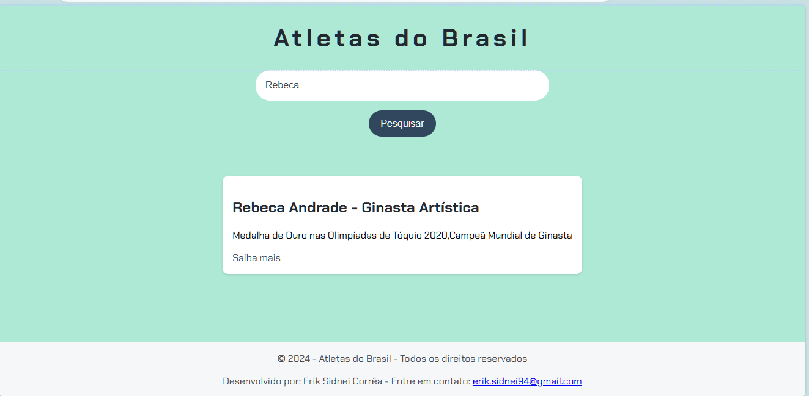

## **README.md - Buscador de Atletas Brasileiros**

💻 Demo
(Vercel)[https://aluragemini-chi.vercel.app/]

### **Sobre a Aplicação**

Fala pessoal! 

Essa aplicação simples, mas poderosa, te permite buscar por seus atletas brasileiros favoritos! 🇧🇷 Digita o nome do atleta que você quer saber mais e pronto, a aplicação vai te mostrar todas as informações que temos sobre ele, como suas conquistas e um link para saber mais. 

### **Como Funciona?**

1. **Busca:** Digita o nome do atleta no campo de busca e clica no botão "Pesquisar".
2. **Resultados:** A aplicação vai vasculhar nossa base de dados e te mostrar todos os atletas que combinam com a sua busca.
3. **Detalhes:** Para cada atleta encontrado, você vai ver o nome, as conquistas e um link para saber mais sobre ele em outro site.

### **Tecnologias Utilizadas**

* **HTML:** A estrutura básica da página, como as seções, botões e campos de texto.
* **CSS:** Responsável por deixar a aplicação com uma cara bonita e organizada.
* **JavaScript:** A mágica por trás da busca! É o JavaScript que lê o que você digita, busca na base de dados e mostra os resultados na tela.

### **Como Usar**

1. **Clone o repositório:** Use o Git para clonar esse projeto para sua máquina.
2. **Abra o index.html:** Abra o arquivo `index.html` em seu navegador favorito.
3. **Comece a buscar:** Divirta-se buscando por seus atletas favoritos!

### **Contribuindo**

Quer ajudar a melhorar essa aplicação? Fique à vontade para abrir um pull request! 

**Observações:**

* **Base de dados:** A base de dados dos atletas está armazenada no arquivo `dados.js`.
* **Estilos:** Os estilos da aplicação estão no arquivo `styles.css`.
* **Lógica:** A lógica da busca está no arquivo `main.js`.

**Vamos juntos torcer pelo Brasil! 🇧🇷**

**#olimpiadas #atletasbrasileiros #busca #javascript #html #css**

